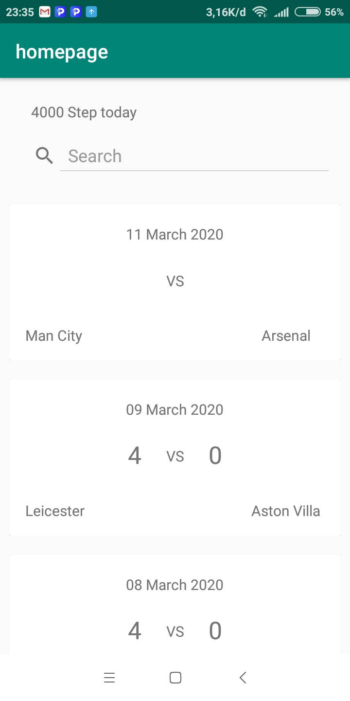
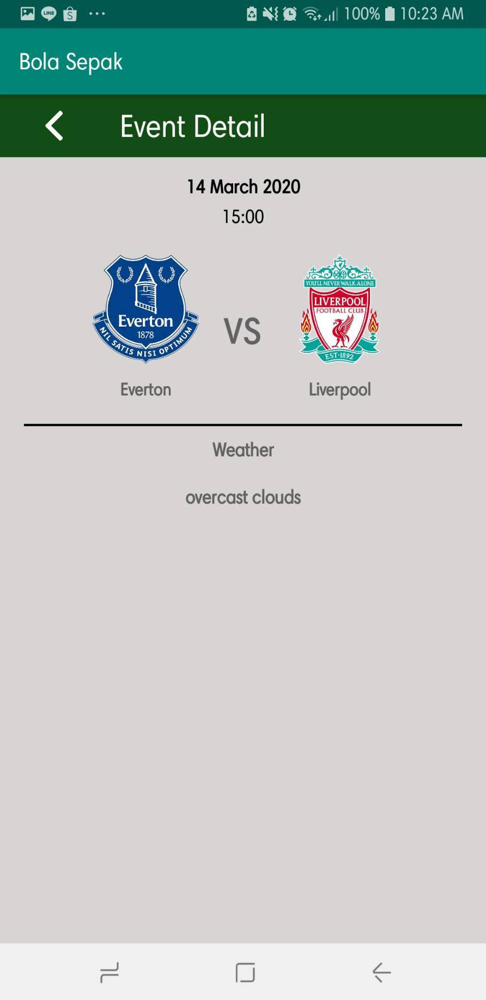
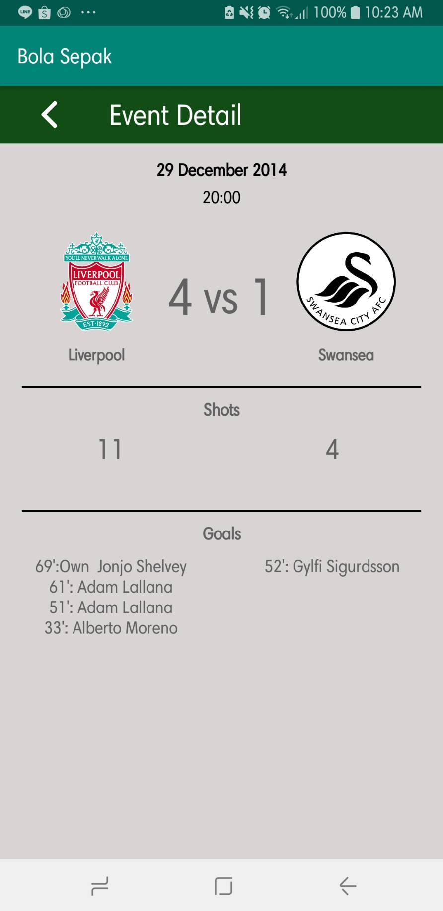
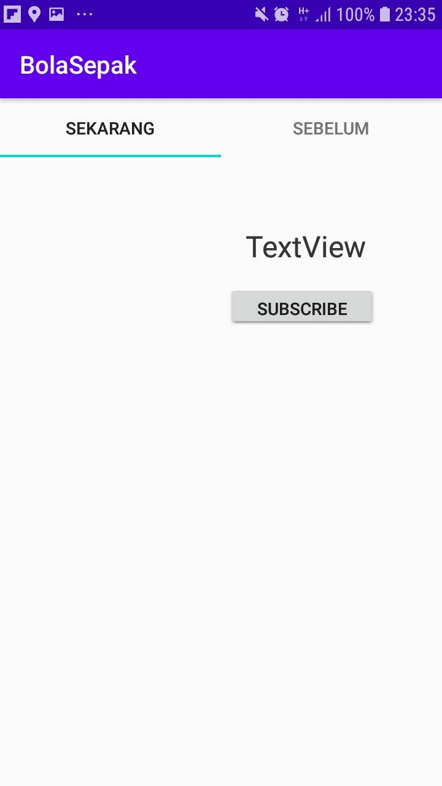
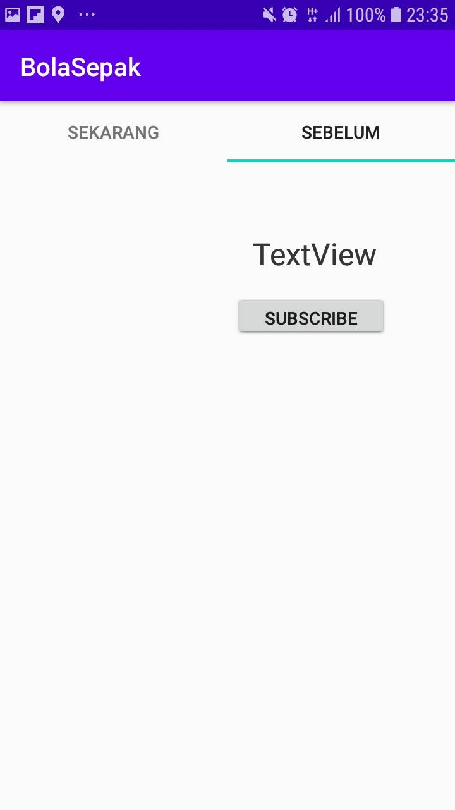

# IF3210-2020-40-BolaSepak

## 1. Deskripsi aplikasi
Fitur utama dari BolaSepak adalah memberikan schedule pertandingan sepak bola yang akan datang, dan juga yang sudah lewat. Selain schedule BolaSepak juga perlu menunjukkan lokasi pertandingan sepak bola dan juga cuaca di lokasi pertandingan tersebut. Selain itu pengguna juga dapat melihat profil sebuah tim beserta pertandingan yang pernah dijalani. Pengguna dapat subscribe pada sebuah tim dan akan mendapatkan notifikasi ketika tim tersebut mengikuti pertandingan baru. Selain itu, untuk mendorong asisten mata kuliah IF3210 agar lebih sering berolahraga, aplikasi BolaSepak juga memiliki sebuah step counter untuk menghitung berapa langkah yang telah diambil asisten yang direset setiap harinya.

## 2. Cara kerja, terutama mengenai pemenuhan spesifikasi aplikasi
Aplikasi pada awalnya menampilkan halaman utama yang isinya 15 pertandingan yang sudah berlalu dan 15 pertandingan yang akan datang
ketika diklik eventnya maka akan menuju ke halaman event detail dan jika jadwal pertandingan tersebut belum mulai maka akan menampilkan jadwal dan 
prakiraan cuaca pada jadwal tersebut dan jika jadwal pertandingan tersebut telah lewat maka akan menampilkan skor, pencetak gol, shot, dll. Dan jika diklik
teamnya maka akan muncul halaman team detail. 

## 3. Library yang digunakan dan justifikasi penggunaannya
RecyclerView : Untuk menampilkan tampilan dengan template yang sama berulang kali
Volley : Untuk mengambil data dari API
CardView : Untuk merapikan bagian dari RecyclerView
Picasso : Untuk merender gambar dari URL

## 4. Screenshot aplikasi

